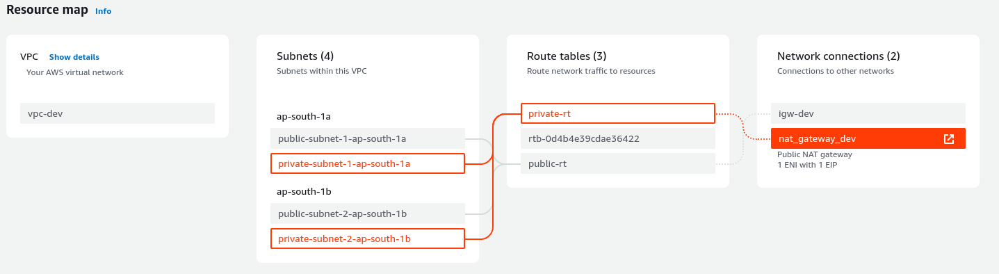
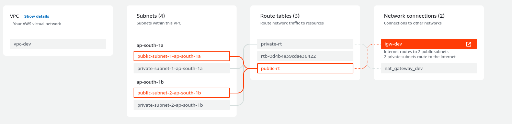

### AWS VPC Configuration using Terraform.
In this repo. we'll see vpc creation and its components. 
the components involved in VPC are:
1. vpc
2. internetGateWay for internet access (internet for in and out)
3. Subnets - chunks of blocks in vpc
4. NatGatWay - for private subnets. (only outbounds - inside instance in private subnet connects to external sources)
5. route tables and its association to subnets to route internet.

## 1-First create Provider and VPC
```sh
resource "aws_vpc" "vpc-dev" {
  cidr_block = var.vpc_cidr
  tags = {
    Name = var.vpc_name
    Environment = var.Environment
  }
}
```
## 2- Create internetGateWay
```sh
resource "aws_internet_gateway" "igw" {
  vpc_id = aws_vpc.vpc-dev.id
  tags = {
    Name = "igw-${var.Environment}"
  }
}
```
## 3- Create Subnets
```sh
#Private Subnets
resource "aws_subnet" "private-subnets" {
  count = length(var.private_cidr) ## length function is used to get number of cidr valurs.
  vpc_id = aws_vpc.vpc-dev.id
  cidr_block = element(var.private_cidr, count.index) #pick one by one element fron count (which is length). here length/count and element acts like a for look (total numbers - pick/loop each element from count)
  availability_zone = element(var.a_z, count.index)
  tags = {
    "Name" = "private-subnet-${count.index+1}-${var.Environment}"
    "kubernetes.io/role/internal-elb" = "1"
  }
}
##Public Subnets
resource "aws_subnet" "public-subnet" {
  vpc_id = aws_vpc.vpc-dev.id
  count = length(var.public_cidr)
  cidr_block = element(var.public_cidr, count.index)
  availability_zone = element(var.a_z, count.index)
  map_public_ip_on_launch = true
  tags = {
    "Name" = "public-subnet-${count.index+1}-${var.Environment}"
    "kubernenets.io/role/elb" = "1"     
   }
}
```
#### create 4 subnets 2 are for public and rest for private subnets.
## 4- Now create NatGatWay along with elastic ip
 ```sh
resource "aws_eip" "eip" {
  domain = "vpc"
  tags = {
    "Name" = "eip_${var.Environment}"
  }
}
resource "aws_nat_gateway" "nat" {
  count = 1
  allocation_id = aws_eip.eip.id
  subnet_id = element(aws_subnet.public-subnet[*].id, 0)
  tags = {
    "Name" = "nat-${var.ENvironment}"
  }
}

```
## 5- Finally create route tables and associate them to subnets.
```sh
resource "aws_route_table" "private-rt" {
  vpc_id = aws_vpc.vpc-dev.id
  route {
    cidr_block = "0.0.0.0/0"
    nat_gateway_id = aws_nat_gateway.nat[0].id #nat gatway should sit in any one public subnet, so given first indexed subnet instead of *
  }
  tags = {
    "Name" = "private_rt-${var.Environment}"
  }
}
resource "aws_route_table" "public-rt" {
  vpc_id = aws_vpc.vpc-dev.id
  route {
    cidr_block = "0.0.0.0/0"
    gateway_id = aws_internet_gateway.igw.id
  }
  tags = {
    "Name" = "public_rt-${var.Environment}"
  }
}

resource "aws_route_table_association" "private" {
  count = length(var.private_cidr)
  subnet_id = element(aws_subnet.private-subnets[*].id, count.index)
  route_table_id = aws_route_table.private-rt.id
}

resource "aws_route_table_association" "public" {
  count = length(var.public_cidr)
  subnet_id = element(aws_subnet.public-subnet[*].id, count.index)
  route_table_id = aws_route_table.public-rt.id
}

```

This will create a VPC with 4 subnets, half with private and rest are public subnets.
Finally you can visualize the vpc network in screenshots:
screenshot-1

screenshot-2



### EKS Setup.
1- To create eks cluster, we need policy and role for the eks cluster.
Policy - `AmazonEKSClusterPolicy`
Above policy is attached to role for assumeRole   `eks.amazonaws.com`

2- Attach above created role to eks cluster while provisioning.

3- you can provide cluster endpoint private or public, if it is private shall be access a bastion host inside same vpc where eks exists of should vpn available. for public you can acces cluster enpoint publicly. [eks.tf](6-eks.tf)

4- TO create eks-nodes, we need ec2 policy for ec2 instances as a nodes. with policy `AmazonEKSWorkerNodePolicy`, ECR policy `AmazonEC2ContainerRegistryReadOnly` and CNI policy for container network interface inside workers and control plane.

5- Create OIDC provider for service accounts create for pod permissions. for eg, if pod needs to communicate with other aws services, then it need iam roles to be attahced which is serivce accounts; here we require service accoutns for cluster-autoscaler and s3 bucker to access some file for test.

6- Deploy autosclaer once after oidc  and autoscaler-role.tf files are applied. Then deploy cluster autoscaler in cluster where cluster-autostcaler.yaml file is available.
`kubectl apply -f k8s/cluster-autoscaler.yaml` - to deploy autoscaler which is useful auto scale workers based on resources lack.
##### Note : Check service account conf (account_id), cluster name and version in cluster-autoscaler.yaml. other wise autosaler will not perform scaling operations.
6- Finally test-iam-roles.tf file is a  permission for s3 access, apply it and test deploy pod and exec in and check `aws s3 ls`

------------------------------------------------------------------------------------------------
